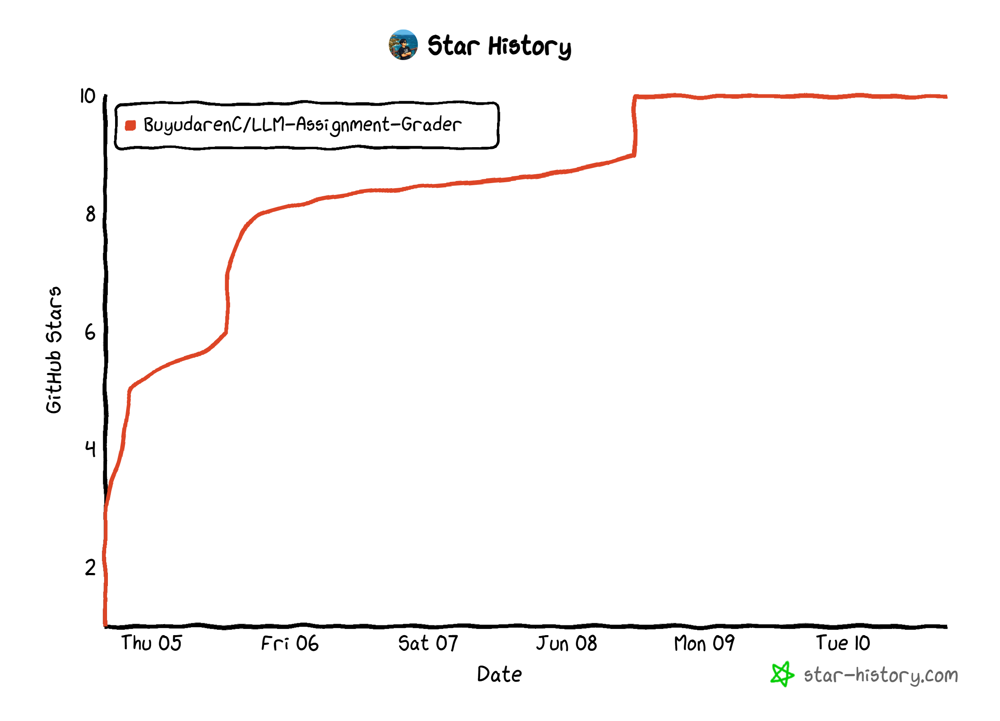

<div align='center'>
    
    <h1>LLM-Assignment-Grader</h1>
</div>

<div align="center">
  
  
  
</div>

<div align="center">
  <h3>📚 使用大模型自动化批改学生作业</h3>
  <p><em>使用大语言模型批改学生作业，解放双手，效率起飞！</em></p>
</div>


---

## 🎯 项目介绍

LLMGrader 是一个智能化的课程评分系统，利用大语言模型（LLM）自动评估学生提交的技术类实验报告。系统支持批量处理 Markdown 报告、分析项目结构和审查 Git 提交历史，生成标准化的评分结果，显著提升教学评估的效率与一致性。

### 🌟 核心价值

- **解放双手**：自动化批改，告别重复性评分工作
- **标准统一**：基于AI的一致性评分，减少主观差异
- **效率提升**：批量处理多个学生作业，节省大量时间
- **智能分析**：深度理解报告内容，提供详细评分依据

### 项目结构

```
LLM_auto_homework_check/
├── 📁 llm_gen/                 # 核心功能模块
│   ├── 🐍 llm_gen.py           # 主程序入口
│   ├── 🔧 extract.py           # 内容提取器
│   ├── 📁 fs_utils.py          # 文件系统工具
│   ├── 🤖 llm_utils.py         # LLM 接口封装
│   ├── 💬 prompt_utils.py      # 提示词管理
│   ├── 📊 feedback_utils.py    # 评语生成工具
│   ├── 🔔 issue_utils.py       # GitLab issue创建工具
│   └── 📁 prompt_template/     # 评分模板库
├── 🔧 clone.sh                 # 仓库克隆脚本
├── 🌿 branch.sh                # 分支处理脚本
├── ⚡ main.sh                  # 一键执行脚本
├── 📋 requirements.txt         # Python 依赖
└── 📖 README.md               # 项目文档
```

---

## ✨ 功能特性

- 🔍 **智能报告分析**：深度解析 Markdown 格式的实验报告内容
- 📁 **结构规范检查**：基于 `tree` 命令结果评估项目组织规范性
- 🔄 **Git 流程审查**：通过 `git log` 分析提交历史的合理性
- 🤖 **AI 驱动评分**：集成 DeepSeek/GPT 等先进模型生成结构化评分
- ⚡ **批量处理**：支持同时处理多个学生仓库的作业内容
- 🛡️ **注入防护**：内置多重安全机制防止恶意提示词攻击
- 📊 **结构化输出**：生成JSON格式的详细评分结果和分析报告

### 安全机制

系统内置多层防护机制，防止学生在报告中嵌入恶意提示词：

1. **边界隔离**：使用明确标记分割不同内容源
2. **身份锁定**：强化系统评分身份，忽略角色操控指令  
3. **格式约束**：强制 JSON 输出，避免非结构化干扰
4. **内容过滤**：预处理阶段移除潜在的注入代码

---

## 🚀 快速开始

### 前置要求

- Python ≥ 3.8
- Git 命令行工具
- DeepSeek 或 OpenAI API 访问权限

### 一键安装

```bash
git clone <repository-url>
cd LLM_auto_homework_check

pip install -r requirements.txt

echo "your-api-key-here" > llm_gen/openai.key
```

### 立即运行

#### 方法一：全自动批处理（推荐）

```bash
# 一键处理所有章节
bash main.sh

# 自定义参数运行
bash main.sh -b "/path/to/student/repos" -o "results" -t "/path/to/templates"
```

#### 方法二：指定章节处理

```bash
python3 llm_gen/llm_gen.py -c "0x01"

python3 llm_gen/llm_gen.py -b "/custom/path" -o "my_results" -c "0x03"

# 强制重新处理
python3 llm_gen/llm_gen.py -c "0x01" -f
```


### 批量克隆学生仓库

```bash
# 1. 获取项目列表
curl --header "PRIVATE-TOKEN: <token>" \
     "https://github.com/api/v4/groups/ccs%2F2025-penetration/projects?per_page=100" \
     > projects.json

# 2. 提取仓库URL
jq -r '.[].http_url_to_repo' projects.json > repo_urls.txt

# 3. 批量克隆
bash clone.sh

# 4. 处理分支
bash branch.sh
```

---

## ⚙️ 配置说明

###  API 配置

#### 支持的LLM提供商

- **DeepSeek**（推荐）- 性价比高，中文理解能力强
- **OpenAI GPT 系列** - 老牌稳定，功能全面

#### 配置步骤

1. 在 `llm_gen/` 目录下创建 `openai.key` 文件：

```bash
echo "your-deepseek-or-openai-api-key" > llm_gen/openai.key
```

2. 确保API密钥具有适当的访问权限

### 模板配置

#### 模板目录结构

评分模板存储在 `prompt_template/` 目录下，每个章节对应一个子目录：

```
prompt_template/
├── 0x01/          # 第一章评分模板
├── 0x02/          # 第二章评分模板
└── ...            # 其他章节
```

#### 添加新章节

1. 在 `prompt_template/` 下创建新的章节目录
2. 添加对应的评分标准模板文件
3. 系统将自动识别并处理新章节

### 输出格式

系统默认生成 JSON 格式的结构化评分结果，包含：

- **各评分项详细分数**：每个评分维度的具体得分
- **总分统计**：综合评分结果
- **评分依据说明**：详细的评分理由和建议
- **项目结构分析**：代码组织规范性评估
- **Git提交历史评价**：开发过程合理性分析

---

## 🤝 贡献指南

我们热烈欢迎各种形式的贡献！无论是代码优化、功能建议、文档完善还是bug报告，都能帮助项目变得更好。

### 贡献流程

1. **Fork** 项目仓库到您的账户
2. 创建特性分支 (`git checkout -b feature/AmazingFeature`)
3. 提交您的更改 (`git commit -m 'Add some AmazingFeature'`)
4. 推送到特性分支 (`git push origin feature/AmazingFeature`)
5. 创建 **Pull Request** 并详细描述您的改动

### 贡献类型

- **🐛 Bug修复**：发现并修复系统缺陷
- **✨ 新功能**：添加有价值的新特性
- **📚 文档改进**：完善项目文档和使用说明
- **🎨 代码优化**：提升代码质量和性能
- **🧪 测试用例**：增加测试覆盖率

### 提Issue指南

提交Issue时请包含：
- 清晰的问题描述
- 复现步骤（如果是bug）
- 期望的行为
- 实际的行为
- 系统环境信息

---

## 🙏 致谢

核心贡献者：

- [BuyudarenC](https://github.com/BuyudarenC) 

- [Lime-Cocoa](https://github.com/Lime-Cocoa) 

- [kal1x](https://github.com/kal1x) 

- [dangyuyan](https://github.com/dangyuyan)

<div align=center style="margin-top: 30px;">
  <a href="https://github.com/BuyudarenC/LLM_auto_homework_check/graphs/contributors">
    
  </a>

</div>

## Star History

<div align='center'>
    
</div>

**如果这个项目对您有帮助，请考虑给我们一个 ⭐**
